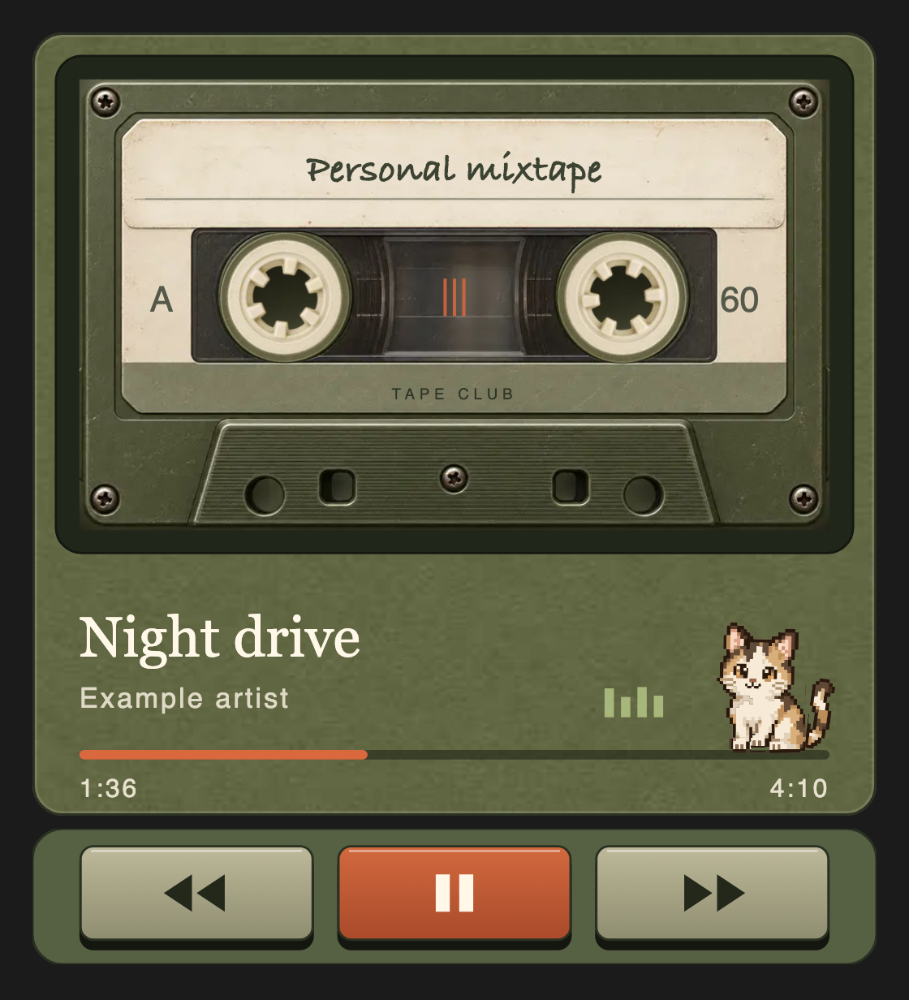
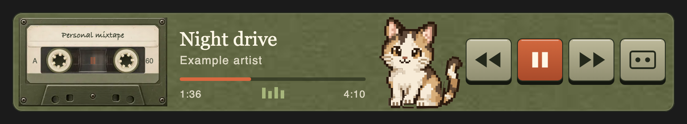

# pet-amp-mod

A cassette deck for Spotify and Apple Music inside Claude Code, with a pixel cat
that dances to the beat of whatever is playing.





Two parts:

| Part | What it is |
| --- | --- |
| [`mod/`](mod) | **Tape Club**, a Claude Code mod: the deck pane, the band above the prompt, the cat and the `/tape` command |
| [`beat/`](beat) | **Mac Pulse Beat**, a menu-bar app that listens to the music and tells the cat the real tempo |

The mod works on its own: the cat then keeps a steady 100 BPM (or the track's
BPM tag in Music). With Mac Pulse Beat running, it moves to the song's beat.

An unofficial mod. Not made or endorsed by Anthropic, Apple or Spotify.

## Requirements

- macOS 15 or later.
- The Spotify desktop app or the Music app. The Spotify web player does not
  work: the mod drives the player through AppleScript.
- The Claude desktop app with function-hook plugins ("mods"). Tested with
  Claude Code 2.1.281. That API is early access and may change between
  releases. In a terminal the mod falls back to a line of text with buttons.
- Swift 6 (Xcode or the Command Line Tools) to build Mac Pulse Beat.

## Install

1. Clone the repository:

   ```sh
   git clone https://github.com/natplot/pet-amp-mod ~/.claude/mods/pet-amp-mod
   ```

2. Turn the mod on in `~/.claude/settings.json`, with the absolute path to
   `mod/`:

   ```json
   {
     "env": {
       "CLAUDE_CODE_PLUGIN_DIRS": "/Users/YOU/.claude/mods/pet-amp-mod/mod",
       "CLAUDE_CODE_ENABLE_FUNCTION_HOOKS": "1"
     }
   }
   ```

3. Build and start Mac Pulse Beat:

   ```sh
   bash ~/.claude/mods/pet-amp-mod/beat/scripts/install.sh
   ```

4. Play something in Spotify, open a new Claude session and type `/tape`.

macOS asks once for permission to control Spotify (or Music), and once for
permission to record system audio for Mac Pulse Beat.

## Using it

| Command | Does |
| --- | --- |
| `/tape` | Turns the mod on in this session and opens the deck |
| `/tape off` | Turns it off: no band, no deck, no polling, no listening |
| `/tape close` | Closes the deck, keeps the band |
| `/tape keys` | Switches between the drawn keys and plain system buttons |
| `/tape vector` / `/tape raster` | Draws the cassette as plain shapes, or from the pictures |

While the mod is on and music plays, it asks Mac Pulse Beat for the beat.
Pause or `/tape off`, and the app stops listening within about 12 seconds.

More in [`mod/README.md`](mod/README.md) and [`beat/README.md`](beat/README.md).

## License

[MIT](LICENSE)
